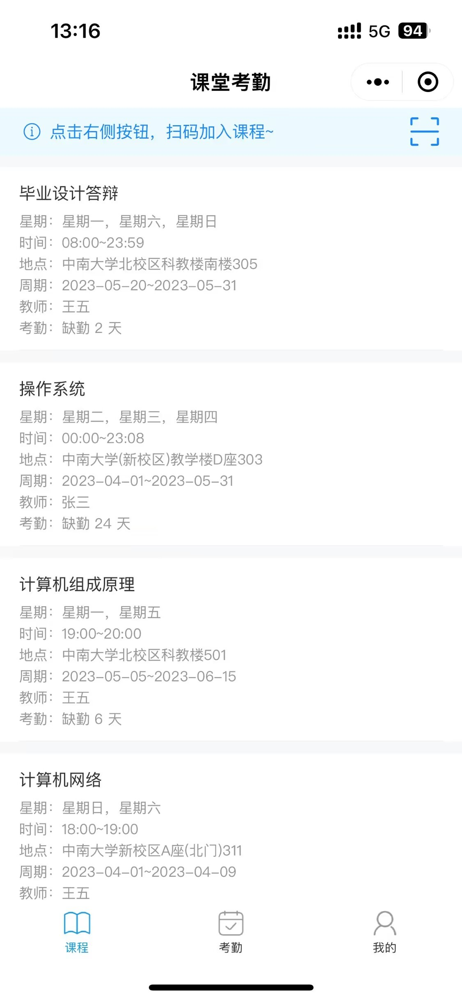
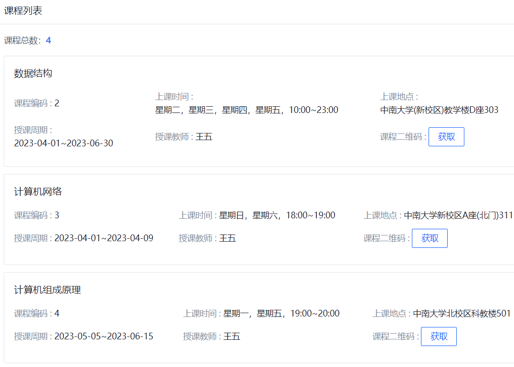
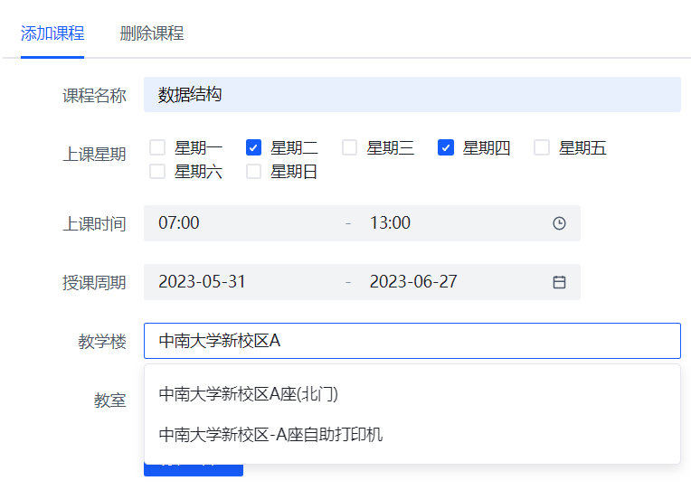

# 课堂考勤

## 技术栈

- 教师端（前端）：TypeScript + React18
- 教师端（后端）：TypeScript + Koa2 + MySQL
- 学生端（前端）：TypeScript + 微信小程序
- 学生端（后端）：TypeScript + Koa2 + MySQL

## 三方服务

- 百度智能云：人脸识别（人脸检测、人脸对比）
- 高德开放平台：Web服务 API（输入提示、路径规划-距离测量、地理编码）
- 阿里云：对象存储 OSS

## 项目部署

[项目部署记录](https://bn17vgx2ja.feishu.cn/docx/LuJ1d7Kvgo9unFxFenecbneynVd)

## 部分功能截图

